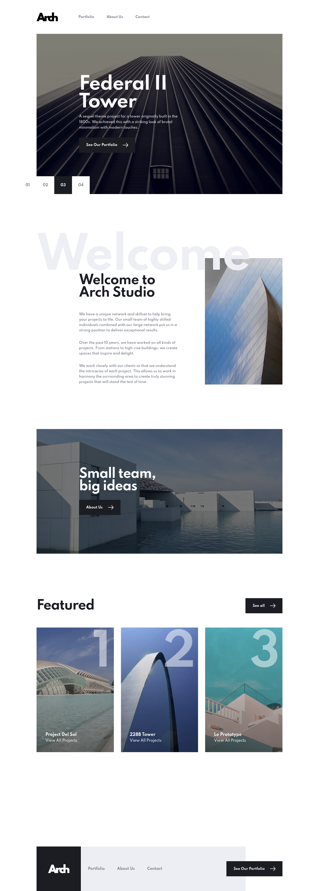
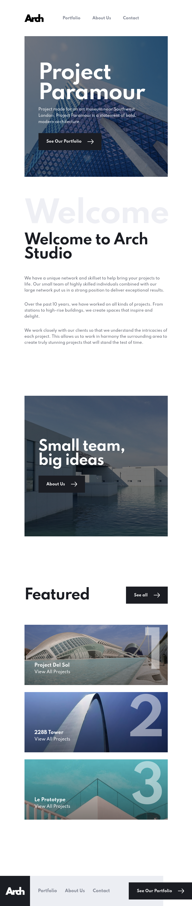
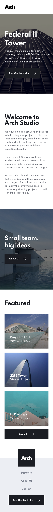

# Frontend Mentor - Arch Studio multi-page website solution

This is a solution to the [Arch Studio multi-page website challenge on Frontend Mentor](https://www.frontendmentor.io/challenges/arch-studio-multipage-website-wNIbOFYR6). Frontend Mentor challenges help you improve your coding skills by building realistic projects.

## Table of contents

-   [Overview](#overview)
    -   [The challenge](#the-challenge)
    -   [Screenshots](#screenshots)
    -   [Links](#links)
-   [My process](#my-process)
    -   [Built with](#built-with)
    -   [Continued development](#continued-development)
-   [Author](#author)
-   [Developing](#developing)
-   [Building](#building)

**Note: Delete this note and update the table of contents based on what sections you keep.**

## Overview

### The challenge

Users should be able to:

-   View the optimal layout for each page depending on their device's screen size
-   See hover states for all interactive elements throughout the site
-   Receive an error message when the contact form is submitted if:
    -   The `Name`, `Email` or `Message` fields are empty should show "Can't be empty"
    -   The `Email` is not formatted correctly should show "Please use a valid email address"
-   **Bonus**: View actual locations on the contact page map. The addresses we have on the design are fictional, so you'll need to add real addresses for this bonus task. **TODO** : get the GMaps key and finish it

### Screenshots

| Desktop               | Tablet              | Mobile               |
| --------------------- | ------------------- | -------------------- |
|  |  |  |

### Links

-   Live Site URL: [Arch Studio](https://arch-studio-svelte.vercel.app/)

## My process

### Built with

-   Semantic HTML5 markup
-   CSS custom properties
-   Flexbox
-   CSS Grid
-   Mobile-first workflow
-   [SvelteKit](https://kit.svelte.dev/) - JS framework
-   [Windi CSS](https://https://windicss.org/) - Next generation utility-first CSS framework.

### Continued development

⬜️ Finish with Map on Contact Page

## Author

-   Ivan Sprut
-   Frontend Mentor - [@ivansprut](https://www.frontendmentor.io/profile/isprutfromua)

## Developing

Once you've created a project and installed dependencies with `npm install` (or `pnpm install` or `yarn`), start a development server:

```bash
npm run dev

# or start the server and open the app in a new browser tab
npm run dev -- --open
```

## Building

To create a production version of your app:

```bash
npm run build
```
